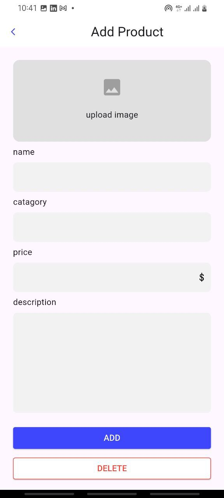

# Basic eCommerce App (Flutter)
A beginner-friendly Flutter project showcasing a simple and functional eCommerce app UI with add/update/delete functionality, navigation animations, and image handling.

# Features
## ✅ Home Page

Displays a list of all added products

Supports dynamic product rendering from memory

Responsive design with product tiles

## ✅ Add Product Page

Allows adding new products with:

- Name

- Category

- Price

- Description

- Image (picked from device gallery using image_picker)

Supports input validation and image preview

Automatically navigates back and updates the product list

## ✅ Product Details Page

Shows all product information in detail (image, name, category, rating, price, and description)

Contains:

Update Button – Pre-fills form with product info for editing

Delete Button – Removes the product from the list

Smooth navigation animation when switching to the update form

### ✅ Update Product

Pre-filled text fields for editing

After updating, returns to the home page with updated data shown immediately

### ✅ Delete Product

Deletes the selected product from the list

Uses Navigator.pop() with state handling to reflect changes

### ✅ Navigation Animations

Smooth transitions between pages using Flutter’s Navigator and animations

📦 Dependencies
flutter

- image_picker – For selecting images from the device

- permission_handler – For accessing gallery

- provider or setState – For managing in-memory state

##  Getting Started
+ Clone this repo:

git clone https://github.com/your-username/ecommerce_app_flutter.git

+ Install dependencies:

flutter pub get

+ Run the app:

flutter run

# Screenshots

## Home page

## Add page

## Details page

## Search page

